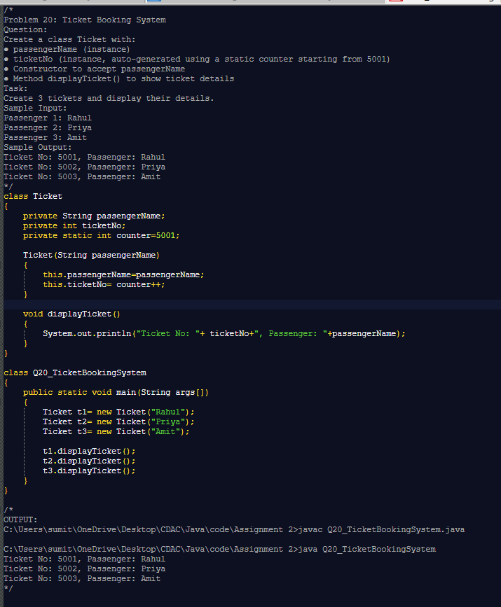

# 🚀 Java OOP Practice Programs

This repository contains a collection of **20 beginner-to-intermediate level Java programs** designed to strengthen **Object-Oriented Programming (OOP) concepts**.  
Each problem is based on a real-world scenario and demonstrates the use of **classes, objects, constructors, static members, methods, and encapsulation**.

---

## 📚 Topics Covered
- ✅ Classes & Objects  
- ✅ Constructors (default, parameterized, overloaded)  
- ✅ Getters & Setters  
- ✅ Static variables, methods, and blocks  
- ✅ Encapsulation  
- ✅ Simple real-world problem modeling  

---

## 📂 Example Problems
1. **Employee Net Salary** – Calculate salary with HRA, DA, and PF.  
2. **Library Book Addition** – Track total books using a static counter.  
3. **Vehicle Registration (Static Counter)** – Auto-generate registration numbers.  
4. **Vehicle Registration (Static Block)** – Print a welcome message only once.  
5. *(and many more… total 20 problems)*  

---
## 🖼️ Sample Code Screenshot

## Q20: Ticket Booking System – Problem, Code & Output

